# Manual de Usuario - Proyecto MANIA

**Ingreso al proyecto a través de "runserver"**

  

Al ejecutar el comando "runserver" en la terminal de Django, se inicia el servidor local donde se aloja la aplicación web del reproductor de música. Este comando es fundamental para visualizar y probar la aplicación en un entorno de desarrollo.

  

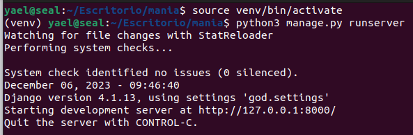

  

**Pantalla “Sing Up Here”**

  

En esta pantalla, los nuevos usuarios pueden registrarse para obtener acceso a la aplicación web del reproductor de música. Solicita la siguiente información:

  

- Username: Campo donde se introduce el nombre de usuario deseado para la cuenta.

- Email: Espacio para ingresar la dirección de correo electrónico del usuario.

- Password: Campo para establecer la contraseña de la cuenta.

- Confirm Password: Campo para re-ingresar la contraseña y confirmar su coincidencia.

- Botón Sign Up: Al presionar este botón, se envían los datos ingresados para crear la cuenta.

- Opción “I have already account”: Un enlace o botón que redirige a los usuarios que ya tienen una cuenta a la pantalla de inicio de sesión.

  

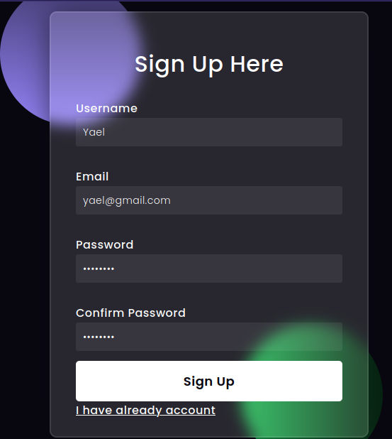

  

**Guardar Sesión**

  

Esta opción, disponible en el navegador, permite al usuario mantener la sesión iniciada incluso después de cerrar el navegador. Proporciona las siguientes opciones:

  

- Guardar Sesión: Funcionalidad que permite mantener la sesión iniciada para futuras visitas. Puede ofrecer la opción de recordar las credenciales de inicio de sesión para mayor comodidad.

- Opción de guardar o no guardar: Proporciona al usuario la elección de mantener la sesión iniciada o cerrarla al salir del navegador, ofreciendo control sobre la privacidad y la seguridad de la cuenta.

  

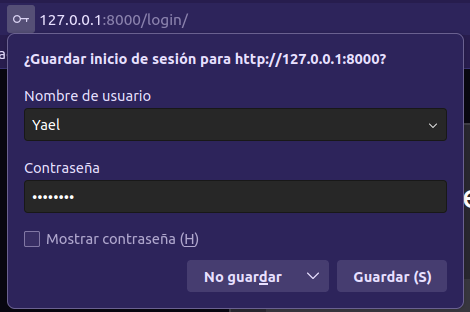

  
  

**Pantalla Login Here**

  

En esta pantalla, los usuarios registrados pueden iniciar sesión en sus cuentas existentes. Solicita la siguiente información:

  

- Username: Campo para ingresar el nombre de usuario asociado a la cuenta.

- Password: Campo para ingresar la contraseña correspondiente a la cuenta.

- Botón Log In: Al presionar este botón, se verifica la información ingresada y se concede acceso si los datos son correctos.

- Opción “Create an account”: Un enlace o botón que redirige a los usuarios que no tienen una cuenta a la pantalla de registro "Sing Up Here", donde pueden crear una cuenta nueva.

  

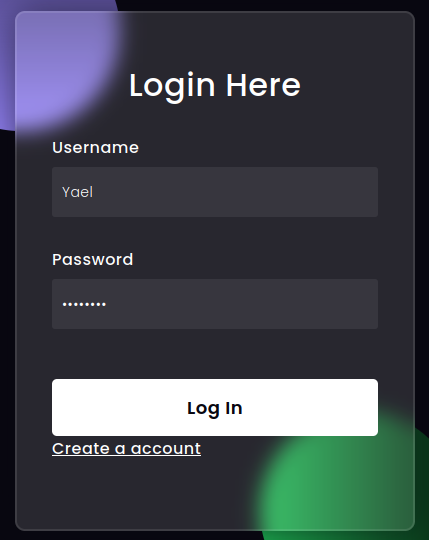

  

**Pantalla principal:**

  

La pantalla principal de la aplicación es la interfaz principal donde los usuarios interactúan con la plataforma. Ofrece una vista previa de la aplicación con los siguientes elementos:

  

- Logotipo: Identifica la marca o nombre de la aplicación.

- Menú General: Ofrece opciones como "Home", "Search", "Your Library", "Your Disc", "Liked Songs" para navegar por diferentes secciones de la aplicación.

- Vista de Álbumes por Género: Muestra una vista general de los álbumes organizados por género musical. Al hacer clic en un álbum, se accede directamente a su contenido, es decir, las canciones dentro de ese álbum.

- Botón de Usuario: Ubicado en la parte superior derecha, muestra el nickname personalizado elegido por el usuario. Al hacer clic en este botón, se accede a la configuración o al perfil del usuario.

- Controles del Reproductor Musical: Se encuentran en la parte inferior de la pantalla y ofrecen botones para reproducir, pausar, avanzar, retroceder y ajustar el volumen de las canciones.

  

Esta vista principal proporciona una visión general de las funciones y opciones disponibles en la aplicación, facilitando la navegación y el acceso a diferentes secciones, álbumes y contenido musical.

  

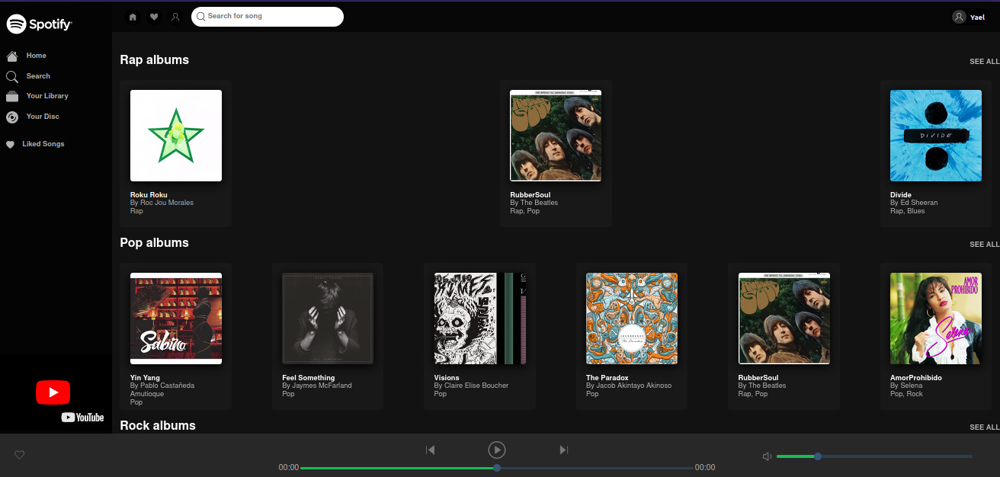

  

**Pantalla de Perfil**

  

La pantalla de perfil es donde los usuarios pueden gestionar su información personal y configurar detalles específicos. Incluye los siguientes elementos:

  

- Foto de Usuario: Se muestra una imagen de perfil, la cual puede ser una foto predeterminada si el usuario aún no ha subido una.

- Email: Muestra la dirección de correo electrónico asociada a la cuenta del usuario.

- Datos:

- Bio: Un espacio donde los usuarios pueden agregar una descripción personal que aparecerá en su perfil.

- Edad: Indicación de la edad del usuario, si se ha proporcionado.

- Perfil Creado: Esta información muestra cuántos días han transcurrido desde la creación del perfil del usuario. Esta cuenta se actualiza automáticamente, reflejando el tiempo transcurrido desde la creación de la cuenta.

  

La pantalla de perfil proporciona una plataforma para que los usuarios gestionen su información personal, brindando la oportunidad de agregar detalles sobre sí mismos y mantener actualizada su información. Esta sección permite una mayor personalización y ofrece una visión general de la actividad y la información de la cuenta del usuario.

  

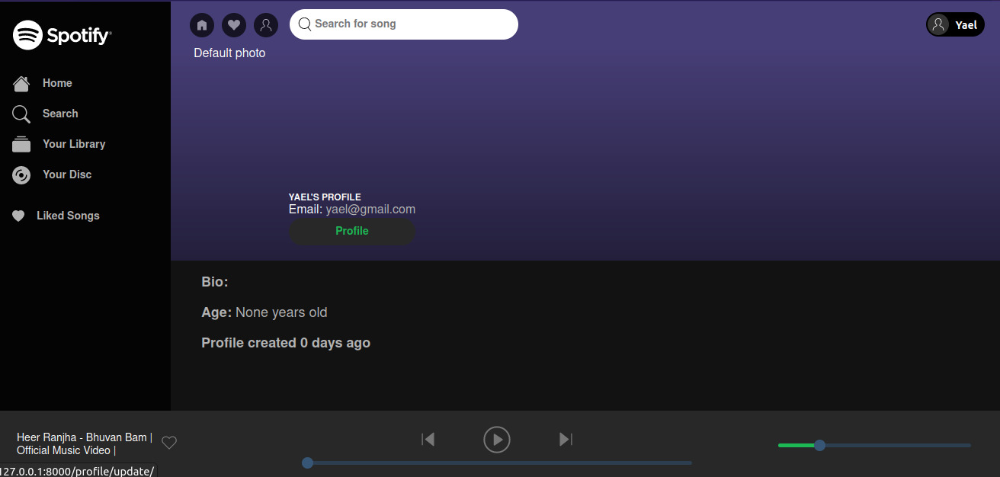

  
  
  

**Pantalla de Actualización de Perfil de Usuario**

  

La pantalla de actualización de perfil de usuario permite editar y modificar la información personal. Ofrece los siguientes campos para actualizar los datos del usuario:

  

- First Name (Nombre): Campo para ingresar el nombre del usuario.

- Last Name (Apellido): Espacio destinado para introducir el apellido del usuario.

- Email: Se muestra la dirección de correo electrónico asociada a la cuenta del usuario. Este campo puede permitir cambios si se requiere actualizar la dirección de correo electrónico.

- Birth date (Fecha de Nacimiento): Espacio para ingresar la fecha de nacimiento del usuario.

- Biography (Biografía): Un área que permite al usuario escribir y actualizar una descripción personal o biografía que deseen compartir en su perfil.

- Botón "Update Profile" (Actualizar Perfil): Al presionar este botón, se guardan los cambios realizados en el perfil del usuario.

- Opción "Don't have any change?" (¿No tienes ningún cambio?): Una opción que permite al usuario regresar sin realizar cambios. Al seleccionar esta opción, se redirige al usuario a la pantalla anterior.

- Botón "Back" (Atrás): Al hacer clic en este botón, se regresa a la pantalla anterior sin aplicar modificaciones.

  

La pantalla de actualización de perfil de usuario facilita la edición y actualización de la información personal, brindando al usuario la posibilidad de mantener sus detalles personales al día y reflejar los cambios pertinentes en su perfil de la aplicación.

  

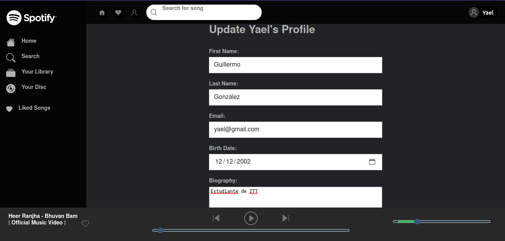

  

Vista previa de actualización de información:

  

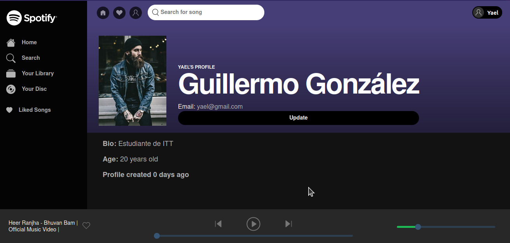

  

**Pantalla de Country Albums**

  

La pantalla de "Country Albums" se encarga de organizar los álbumes musicales según la categoría de país de origen. Aquí se agrupan todos los álbumes que comparten el mismo lugar de origen, permitiendo a los usuarios explorar la música en función de la procedencia geográfica. Algunos elementos clave de esta pantalla incluyen:

  

- Categorización por País: Organización de los álbumes musicales según su país de origen. Los álbumes se agrupan bajo la etiqueta del país al que pertenecen.

- Exploración por Origen Geográfico: Permite a los usuarios explorar y descubrir álbumes musicales específicos de un país en particular.

- Facilidad de Navegación: Proporciona una interfaz intuitiva que permite a los usuarios seleccionar y acceder fácilmente a los álbumes pertenecientes a un país específico.

  

Esta pantalla facilita a los usuarios la búsqueda y el acceso a música según su origen geográfico, ofreciendo una forma organizada y fácil de explorar la diversidad musical proveniente de diferentes países.

  

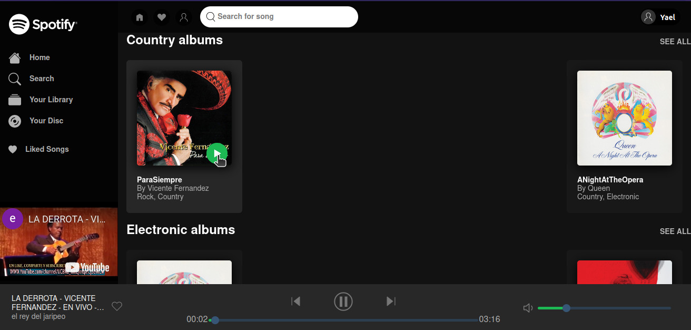

  

**Reproductor Musical**

  

El reproductor musical de la aplicación ofrece un conjunto de opciones para controlar la reproducción de las canciones. Incluye:

  

- Botón "Canción Anterior": Permite retroceder a la canción previa en la lista de reproducción.

- Botón "Pausar Canción": Detiene la reproducción actual de la canción.

- Botón "Siguiente Canción": Avanza a la siguiente canción en la lista de reproducción.

- Indicador de Tiempo Reproducido: Muestra el tiempo transcurrido de reproducción de la canción actual.

- Barra Interactiva de Avance/Atraso: Permite al usuario desplazarse a través de la canción arrastrando el indicador para adelantar o retroceder en la pista.

- Indicador de Duración Total: Muestra la duración total de la canción actual.

  

Estas funciones ofrecen un control total sobre la reproducción de las canciones, permitiendo al usuario pausar, avanzar, retroceder y controlar el tiempo de reproducción de manera precisa. El reproductor brinda una experiencia interactiva y funcional para disfrutar de la música de manera personalizada.

  

Vista previa:

  

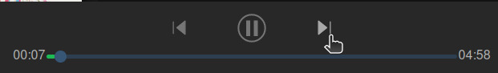

  

Ejemplo de reproductor: “Barra Interactiva de Avance/Atraso”

  

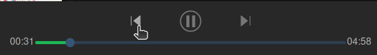

  
  
  
  

**Botón: Álbum**

  

La vista previa de un álbum dentro de la aplicación proporciona información y acceso a su contenido. Contiene:

  

- Imagen de Portada del Álbum: Representa visualmente la carátula o imagen principal del álbum.

- Título del Álbum: El nombre distintivo que identifica al álbum musical.

- Nombre del Artista Creador del Álbum: Muestra el nombre del artista o grupo responsable de la creación del álbum.

- Géneros Musicales del Álbum: Indica los géneros musicales que abarca o representa el álbum, ofreciendo una idea de su estilo musical.

  

Además, esta vista ofrece la posibilidad de ingresar al álbum completo haciendo clic en alguna parte de la información proporcionada. Al hacer clic, se accede al contenido completo del álbum, que incluirá la lista de canciones y posiblemente más detalles acerca de la obra musical. Esta funcionalidad permite a los usuarios explorar y disfrutar del contenido específico de cada álbum con facilidad y rapidez.

  

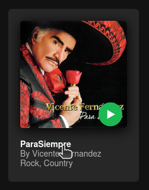

  

**Pantalla: Contenido de Álbum**

La pantalla de contenido de un álbum proporciona una vista detallada de la información del álbum y su lista de canciones. Incluye:

  

- Imagen de Portada del Álbum: Representación visual de la carátula del álbum.

- Título del Álbum: Nombre distintivo del álbum musical.

- Nombre del Artista Creador del Álbum: Nombre del artista o grupo responsable de la creación del álbum.

- Géneros Musicales del Álbum: Indicación de los géneros musicales que abarca el álbum.

- Descripción: Una descripción general o detalles adicionales sobre el álbum.

- Fecha de Lanzamiento: La fecha en la que se lanzó el álbum al público.

- Lista de Canciones del Álbum: Contiene cada canción perteneciente al álbum, organizadas en una tabla con las siguientes columnas:

- Título de la Canción: Nombre de la canción.

- ID Video: Identificación única o enlace a la canción (posiblemente un enlace al vídeo o al contenido multimedia).

- Género de la Canción: Categorización del género musical de la canción.

- Duración de la Canción: Representada por un icono de un reloj, indica la duración de la canción.

  

Además, se ofrece la funcionalidad de reproducir una canción de la lista. Al pasar el cursor sobre una canción específica, aparece un icono de reproducción. Al hacer clic en este icono, se inicia la reproducción de la canción seleccionada, ofreciendo una manera rápida y directa de disfrutar la música contenida en el álbum.

  

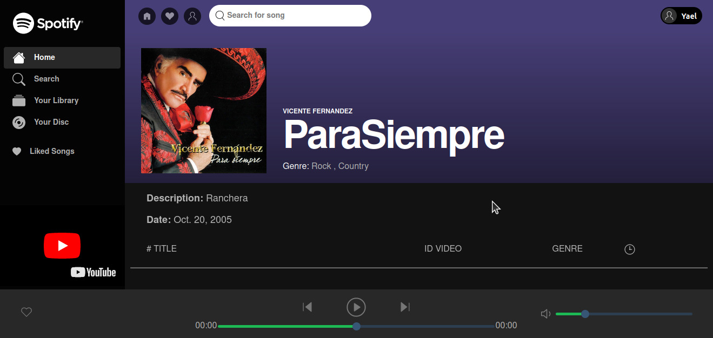

  

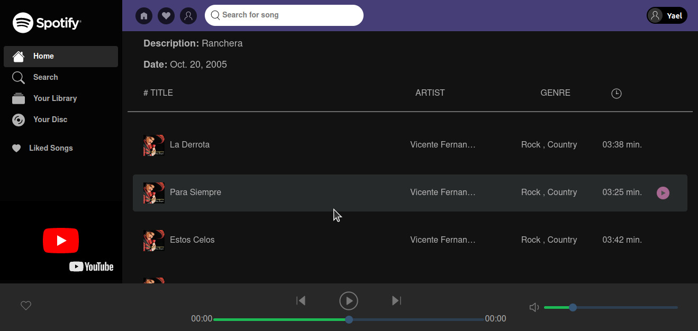

  

- Reproducción de la Canción: Al hacer clic en la canción deseada, se inicia la reproducción de la canción en la interfaz principal del reproductor de música de la aplicación.

- Video de YouTube en Recuadro Inferior Izquierdo: Simultáneamente, se despliega un recuadro en la parte inferior izquierda de la pantalla que reproduce el video de YouTube asociado a esa canción específica. Esto permite una experiencia multimedia más completa al combinar la reproducción de la música con su contenido visual asociado.

  

Esta funcionalidad proporciona una experiencia integrada para los usuarios al escuchar una canción específica al mismo tiempo que ven su video musical correspondiente, ofreciendo una experiencia más inmersiva y completa dentro de la aplicación.

  

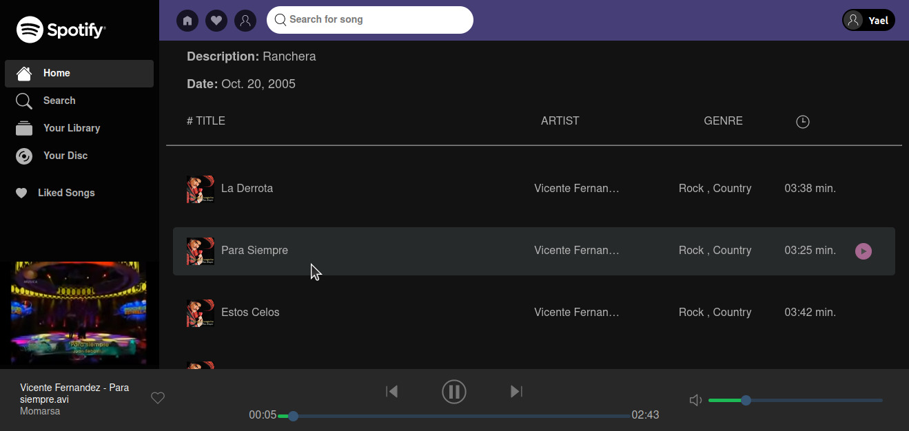

  

**La pantalla de Your Disc**

  

La pantalla "Your Disc" está diseñada específicamente para que los usuarios suban su propia música. Contiene:

  

- Imagen del Usuario: Representación visual del avatar o imagen del usuario que está accediendo a la sección "Your Disc".

- Nombre del Usuario: Nombre o identificación del usuario que ha accedido a su sección personal de discos.

- User Disc (Disco del Usuario): Espacio donde se muestra la colección de discos o canciones pertenecientes al usuario.

- Botón "Create" (Crear): Permite al usuario crear y agregar nuevas canciones o discos a su colección personal.

- Lista de Canciones del Usuario: Muestra la lista de canciones pertenecientes al usuario en su discografía personal.

  

Esta pantalla brinda al usuario la capacidad de administrar y agregar su propia música a su colección personal dentro de la aplicación. El botón "Create" facilita la adición de nuevas canciones o discos, mientras que la lista de canciones permite una rápida visualización y acceso a la música que el usuario ha subido a su perfil.

  

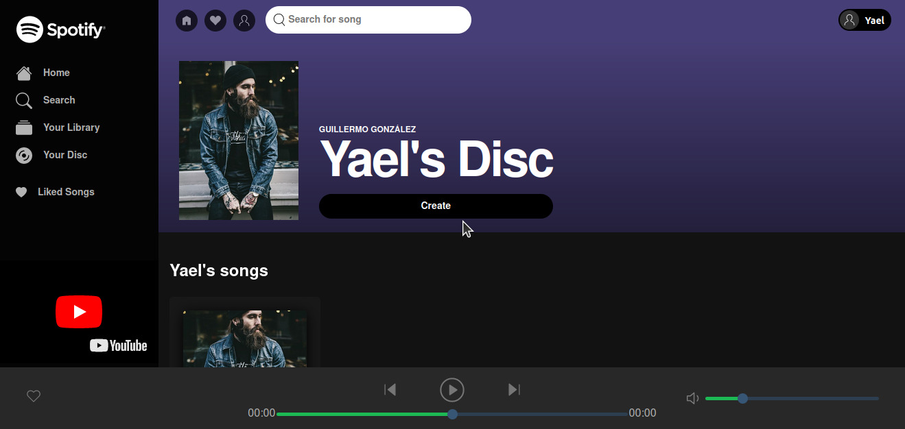

  

Si selecciona el Botón **“Create”** se nos redirige a la pantalla **“Create New Song for your Disc”**

La pantalla "Create a New Song for your Disc" permite a los usuarios agregar una nueva canción a su colección personal. Contiene los siguientes campos de entrada:

  

- Título: Espacio para ingresar el título o nombre de la nueva canción que se desea agregar al disco personal del usuario.

- Género(es) (Uno o más): Campo donde se pueden seleccionar uno o varios géneros musicales que representen la categorización de la canción.

- Duración: Espacio para ingresar la duración de la canción.

- Video (Enlace de YouTube): Campo donde se puede agregar un enlace de YouTube que represente el video asociado a la canción.

- Botón "Create Disc" (Crear Disco): Al presionar este botón, se guarda la información ingresada y se crea la nueva canción en el disco personal del usuario.

  

Esta pantalla brinda la oportunidad al usuario de agregar detalles específicos sobre una nueva canción que desea incluir en su colección personal, proporcionando la información necesaria para identificar y disfrutar la canción dentro de su disco personal en la aplicación.

  

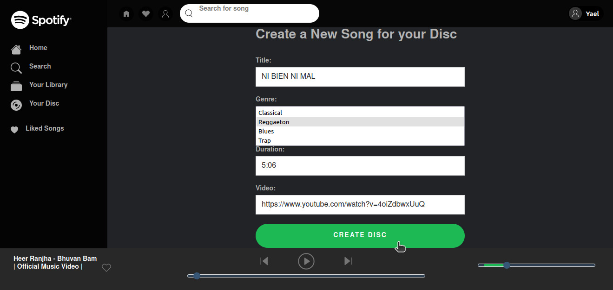

  

Después de crear un álbum, la vista previa del mismo permite al usuario gestionar las opciones relacionadas con ese álbum específico. Esta vista previa incluye:

  

- Información del Álbum: Detalles como la imagen de portada, el título del álbum, el nombre del artista y posiblemente otros detalles relevantes del álbum recién creado.

- Botón "Update" (Actualizar): Permite al usuario realizar modificaciones o actualizaciones en la información del álbum. Al hacer clic en este botón, se accede a la pantalla o formulario que permite editar la información del álbum.

- Botón "Delete" (Eliminar): Ofrece al usuario la opción de eliminar completamente el álbum de su colección. Al seleccionar este botón, se eliminará el álbum y su contenido asociado de la colección personal del usuario.

  

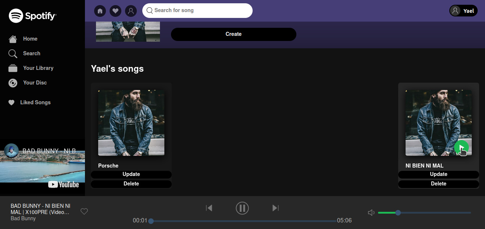

  

**Pantalla Update User Disc**

  

La pantalla "Update User Disc" está destinada a permitir al usuario realizar modificaciones en un disco musical existente en su colección personal. Esta pantalla presenta los siguientes campos:

  

- Título: Campo que permite editar o actualizar el título del disco.

- Canciones (Género): Posibilidad de realizar cambios en las canciones o géneros musicales asociados al disco. Este campo puede ser una lista de canciones con sus respectivos géneros.

- Descripción: Espacio para modificar la descripción o detalles adicionales sobre el disco.

- Video (Enlace): Campo que permite actualizar el enlace del video asociado al disco.

- Botón "Update Disc" (Actualizar Disco): Al hacer clic en este botón, se guardan los cambios realizados en el disco y se actualiza la información correspondiente.

  

Esta pantalla proporciona al usuario la capacidad de editar y mantener actualizado el contenido y los detalles asociados a un disco musical específico en su colección personal dentro de la aplicación.

  

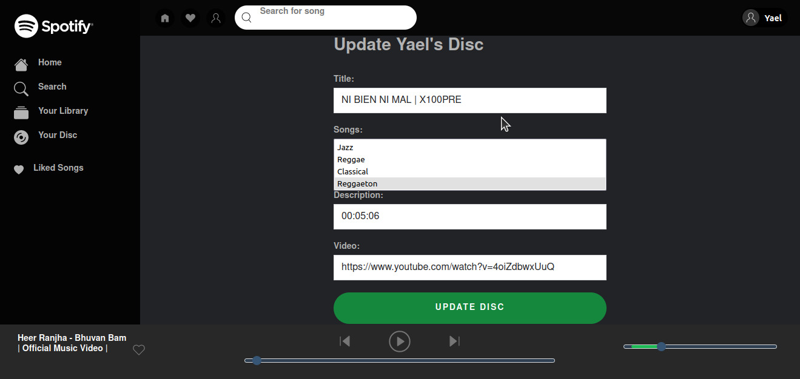

  

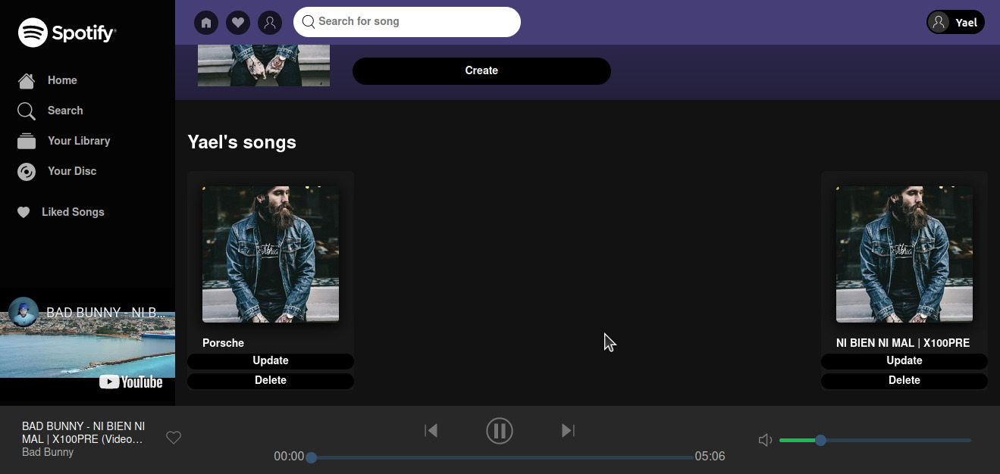

  
  

Cuando se selecciona el botón **"Delete"** (Eliminar), se eliminará el álbum y todo su contenido asociado de la colección del usuario. Esta acción es irreversible y resultará en la eliminación completa de todas las canciones, detalles, y cualquier información relacionada con ese álbum específico en la colección personal del usuario dentro de la aplicación.

  

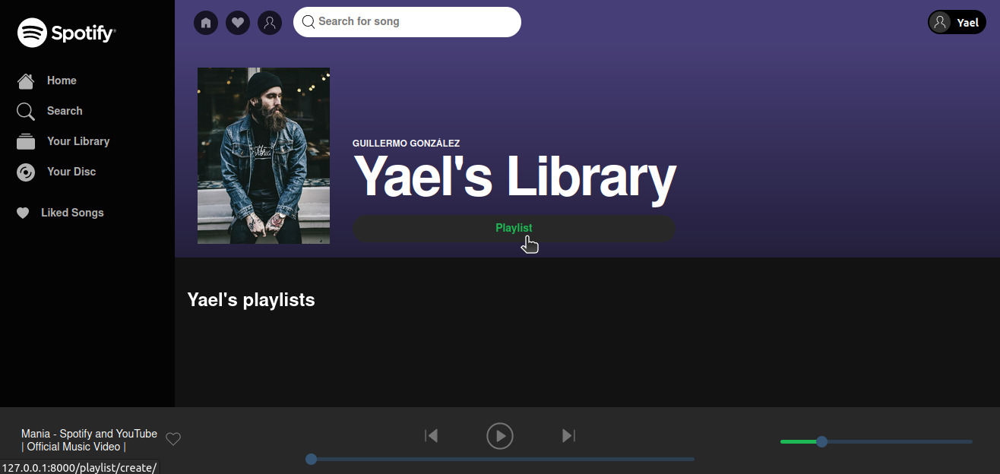

  

**Pantalla Create Playlist**

  

La pantalla "Create Playlist" permite al usuario crear una nueva lista de reproducción personalizada. Esta pantalla presenta los siguientes campos:

  

- Título: Espacio para ingresar el título o nombre de la nueva lista de reproducción.

- Canciones: Área donde se muestra la lista de canciones que formarán parte de la playlist. Posiblemente incluirá una funcionalidad para agregar o seleccionar canciones de la biblioteca del usuario.

- Descripción: Espacio para agregar una descripción o detalles adicionales sobre la lista de reproducción creada.

  

Esta pantalla brinda al usuario la oportunidad de crear una lista de reproducción personalizada, permitiendo la selección de canciones específicas y la adición de detalles descriptivos para identificar y disfrutar de la playlist en la aplicación.

  

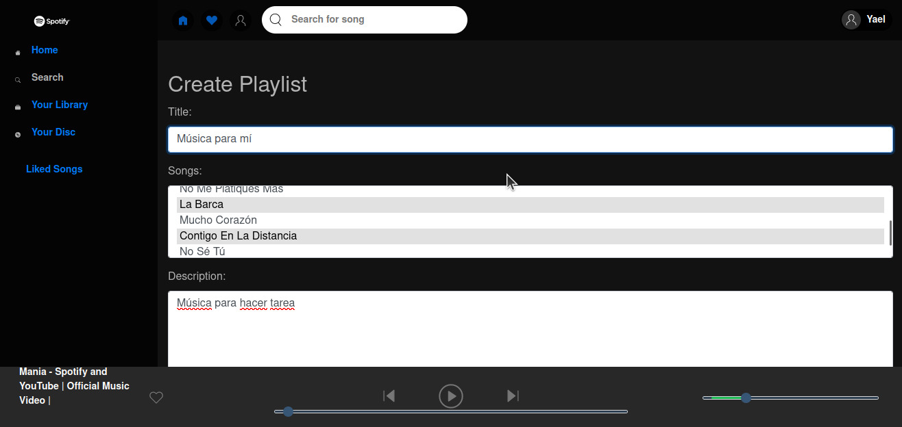

  

Una vez creada la playlist se puede hacer seleccionar para entrar en ella o también se puede pulsar el botón “Update” o “Delete” y realizar operaciones antes mencionadas.

  

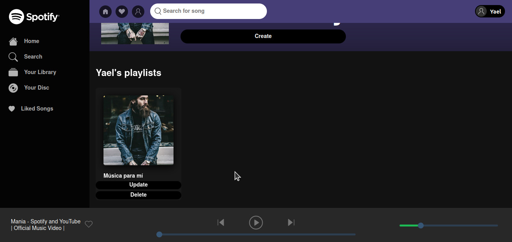

  

Después de crear una lista de reproducción (Playlist), la visualización de la misma ofrece la siguiente información:

  

- Nombre del Usuario que Creó la Playlist: Muestra el nombre del usuario que creó la lista de reproducción.

- Título: El título o nombre de la lista de reproducción.

- Lista de Canciones: Presenta la lista completa de canciones que forman parte de la playlist, mostrando la siguiente información en una tabla o lista:

- Título de la Canción: Nombre de la canción incluida en la lista de reproducción.

- Álbum: Nombre del álbum al que pertenece la canción.

- Artista: Nombre del artista que interpreta la canción.

- Duración: Representada por un icono de un reloj, indica la duración de cada canción en la lista de reproducción.

  

Esta visualización ofrece al usuario una perspectiva detallada de la lista de reproducción creada, mostrando la información relevante sobre cada canción, incluyendo su título, álbum, artista y duración, facilitando así la identificación y disfrute de las canciones incluidas en la playlist.

  

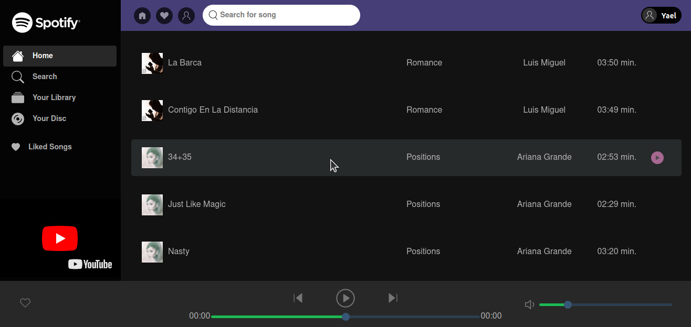

  

**Pantalla Artist Profile**

  

La pantalla del perfil del artista brinda una visión general de la información relacionada con ese artista en particular. Contiene:

  

- Imagen del Artista: Representación visual del artista, que puede ser una foto o imagen distintiva.

- Nombre del Artista: Identificación del nombre del artista.

- Género Musical: Indica el género musical en el que se especializa o con el que se asocia al artista.

- País de Origen: Muestra el país de origen del artista.

- Biografía: Información descriptiva o detalles sobre la trayectoria, estilo musical o logros del artista.

- Edad: Indicación de la edad del artista, si está disponible.

- Álbum: Se muestran todos los trabajos (álbumes) del artista en la plataforma.

  

Esta pantalla ofrece al usuario una visión general de la información clave relacionada con un artista específico, brindando detalles sobre su música, origen y contexto artístico. Esto permite a los usuarios conocer más sobre el artista y su trabajo dentro de la plataforma.

  

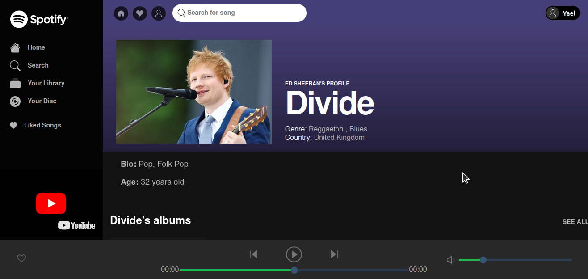

  

**Pantalla Country**

  

La pantalla de "Country Artist" tiene como objetivo agrupar a todos los artistas que comparten el mismo país de origen. Al seleccionar un país específico, se presenta una lista de artistas asociados a ese país. Al hacer clic en uno de los artistas listados, se redirige al usuario a la pantalla del "Artist Profile" del artista seleccionado.

  

En resumen:

  

- Lista de Artistas por País: Muestra una lista de artistas que comparten un país de origen específico.

- Redirección al Artist Profile: Al hacer clic en un artista de la lista, se accede a la pantalla del "Artist Profile" correspondiente a ese artista en particular. Esta pantalla ofrece detalles específicos sobre el artista, como su imagen, nombre, álbumes, género, país, biografía, entre otros detalles relevantes.

  

Esta funcionalidad permite a los usuarios explorar y conocer más sobre los artistas provenientes de un país específico, accediendo fácilmente a la información detallada de cada artista a través de sus perfiles individuales.

  

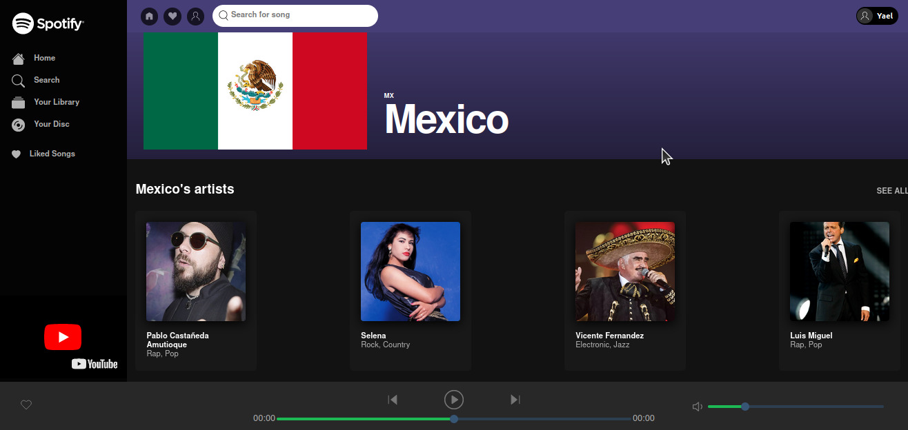

  

**Pantalla Genre**

La pantalla "Genre Artist" se encarga de agrupar a todos los artistas que comparten un mismo género musical. Al seleccionar un género específico, se muestra una lista de artistas relacionados con ese género en particular. Al hacer clic en uno de los artistas listados, se redirige al usuario a la pantalla del "Artist Profile" del artista seleccionado.

  

En resumen:

  

- Lista de Artistas por Género: Muestra una lista de artistas que están asociados con un género musical específico.

- Redirección al Artist Profile: Al hacer clic en un artista de la lista, se accede a la pantalla del "Artist Profile" correspondiente a ese artista en particular. Esta pantalla ofrece detalles específicos sobre el artista, como su imagen, nombre, álbumes, género, biografía, entre otros detalles relevantes.

  

Esta funcionalidad permite a los usuarios explorar y conocer más sobre los artistas que se identifican con un género musical específico, accediendo fácilmente a la información detallada de cada artista a través de sus perfiles individuales.

  

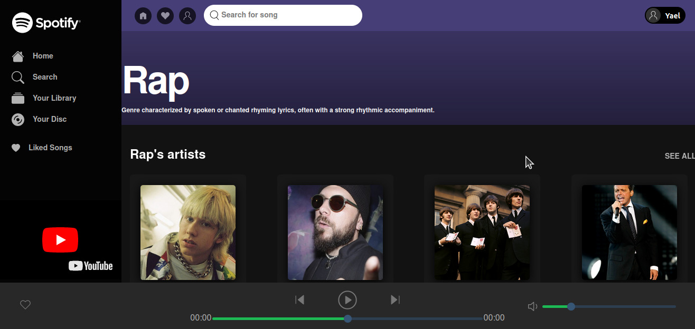
