# User Manual - MANIA Project

**Accessing the project through "runserver"**

By running the "runserver" command in the Django terminal, the local server hosting the music player web application is started. This command is essential to visualize and test the application in a development environment.

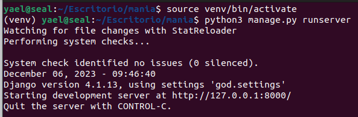

**“Sign Up Here” Screen**

On this screen, new users can register to gain access to the music player web application. It requests the following information:

* Username: Field where the desired username for the account is entered.
* Email: Space to enter the user's email address.
* Password: Field to set the account password.
* Confirm Password: Field to re-enter the password and confirm it matches.
* Sign Up Button: When pressed, the entered data is submitted to create the account.
* “I have already account” Option: A link or button that redirects users who already have an account to the login screen.

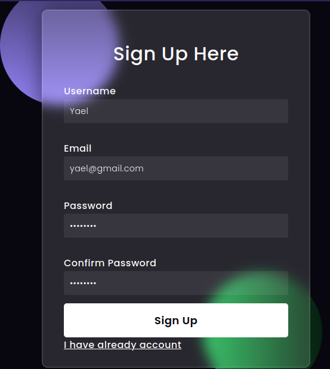

**Keep Session**

This option, available in the browser, allows the user to remain logged in even after closing the browser. It provides the following options:

* Keep Session: Functionality that allows the session to remain active for future visits. It may offer the option to remember login credentials for convenience.
* Save or Not Save Option: Gives the user the choice to stay logged in or log out upon closing the browser, providing control over privacy and account security.

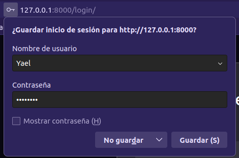

**“Login Here” Screen**

On this screen, registered users can log into their existing accounts. It requests the following information:

* Username: Field to enter the username associated with the account.
* Password: Field to enter the account password.
* Log In Button: When pressed, the entered information is verified and access is granted if correct.
* “Create an account” Option: A link or button that redirects users without an account to the "Sign Up Here" screen to create a new one.

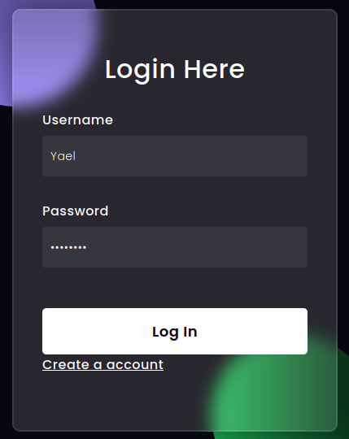

**Main Screen**

The main screen is the primary interface where users interact with the platform. It provides an overview of the application with the following elements:

* Logo: Identifies the brand or name of the application.
* General Menu: Offers options such as "Home", "Search", "Your Library", "Your Disc", "Liked Songs" to navigate through different sections.
* Albums by Genre View: Displays albums organized by musical genre. Clicking an album provides direct access to its songs.
* User Button: Located at the top right, shows the user's nickname. Clicking it opens settings or profile.
* Music Player Controls: Located at the bottom, offering play, pause, next, previous, and volume controls.

This main view provides a general overview of features and options, facilitating navigation and access to content.

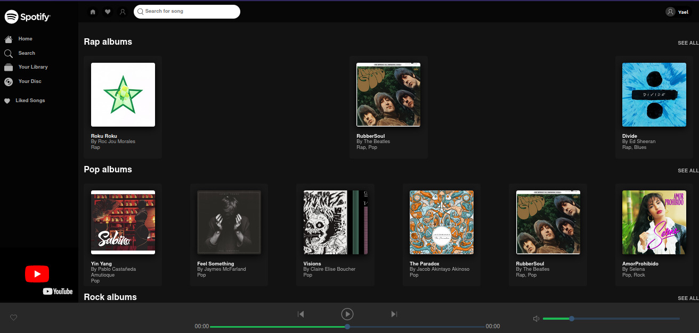

**Profile Screen**

The profile screen allows users to manage personal information and configure details. It includes:

* User Photo: Displays a profile image, which may be default if none has been uploaded.
* Email: Shows the email associated with the account.
* Data:
* Bio: Space to add a personal description.
* Age: Displays the user's age if provided.
* Profile Created: Shows how many days have passed since the profile was created.

This screen allows users to personalize and manage their information.

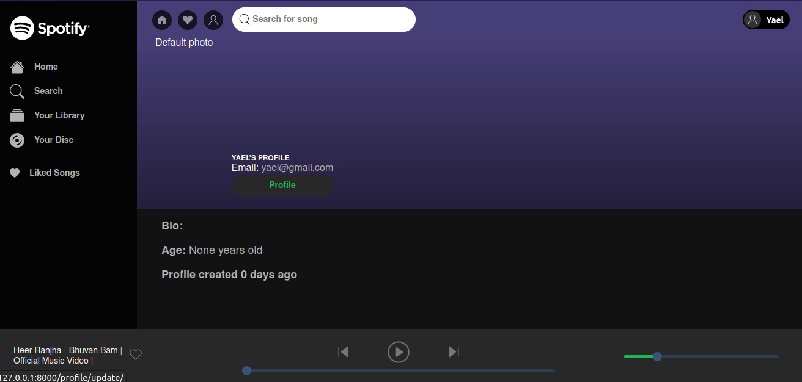

**User Profile Update Screen**

This screen allows users to edit and update personal information. It includes:

* First Name: Field for the user's first name.
* Last Name: Field for the user's last name.
* Email: Displays and may allow updating the email address.
* Birth Date: Field for entering date of birth.
* Biography: Area to write or update a personal bio.
* "Update Profile" Button: Saves changes made.
* "Don't have any change?" Option: Returns without saving changes.
* "Back" Button: Returns to the previous screen without changes.

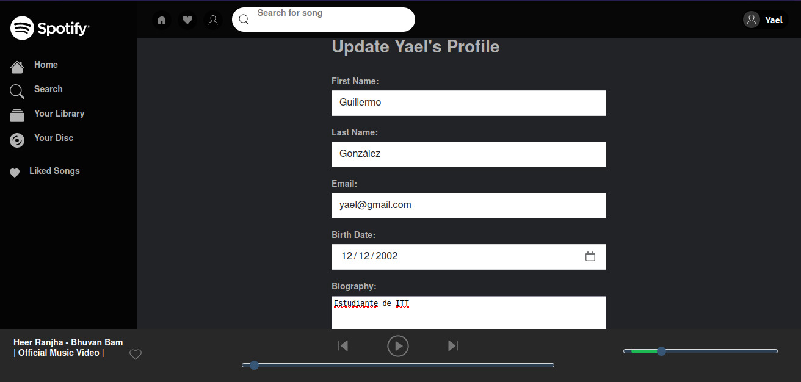

Preview of updated information:

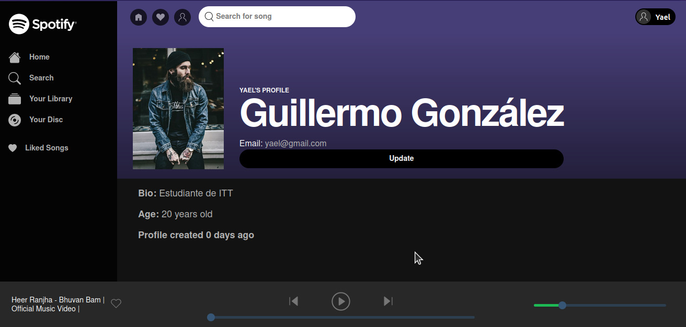

**Country Albums Screen**

This screen organizes albums based on country of origin. It includes:

* Categorization by Country: Albums grouped by their country.
* Exploration by Geographic Origin: Allows discovery of music from specific countries.
* Easy Navigation: Simple interface for accessing albums by country.

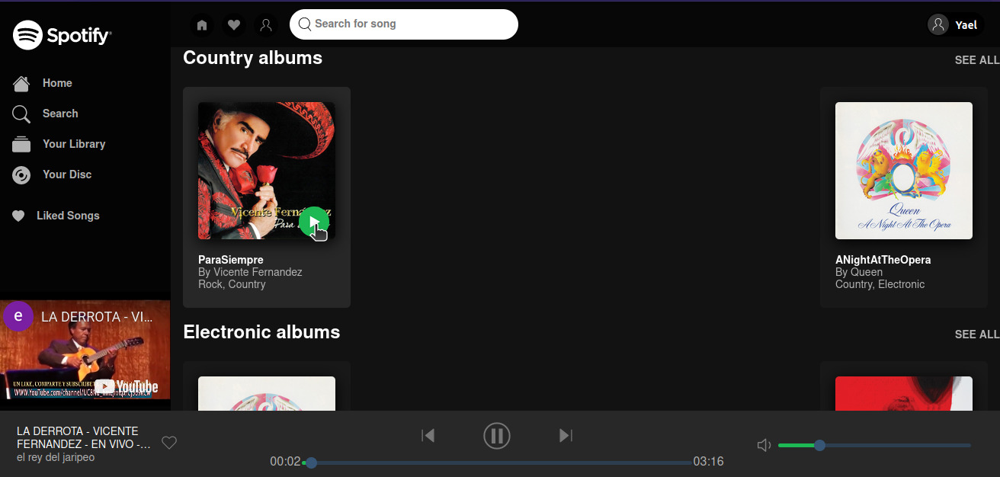

**Music Player**

The music player offers playback control features:

* Previous Song Button
* Pause Button
* Next Song Button
* Playback Time Indicator
* Interactive Progress Bar
* Total Duration Indicator

Preview:

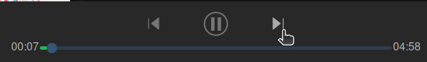

Example:

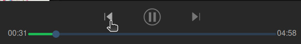

**Album Button**

The album preview includes:

* Album Cover Image
* Album Title
* Artist Name
* Musical Genres

Clicking it opens the full album content.

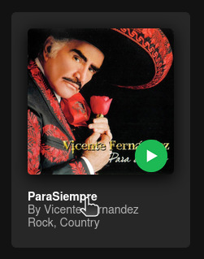

**Album Content Screen**

This screen shows detailed album information:

* Album Cover
* Title
* Artist
* Genres
* Description
* Release Date
* Song List including:

  * Song Title
  * Video ID
  * Genre
  * Duration

Hovering over a song shows a play icon to start playback.

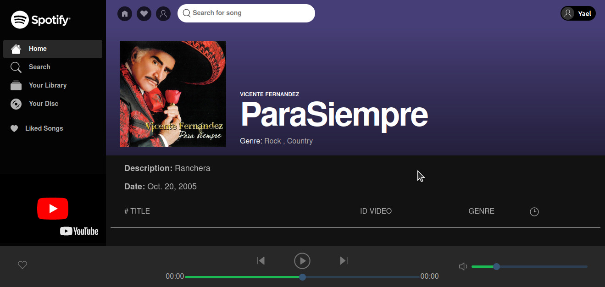

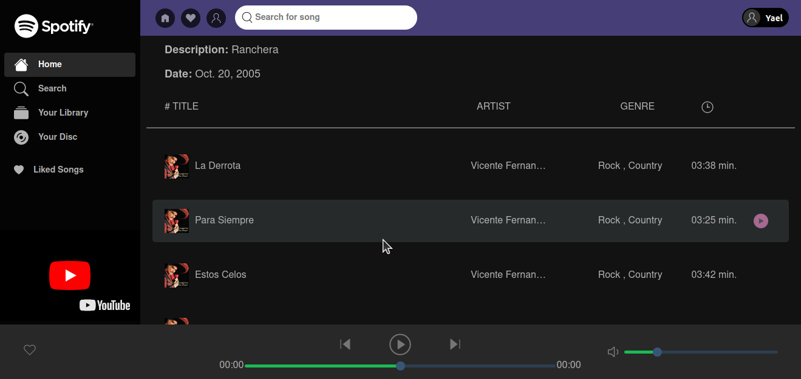

* Song Playback: Starts playing the selected track.
* YouTube Video Display: A video appears at the bottom-left corner for a multimedia experience.

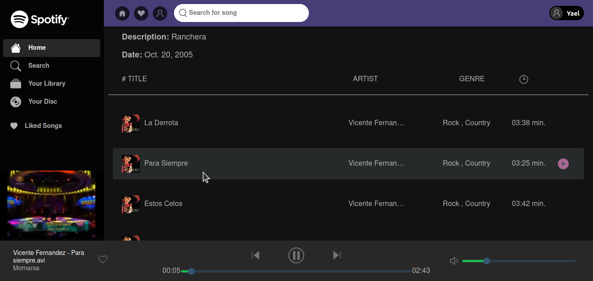

**Your Disc Screen**

This screen allows users to upload their own music:

* User Image
* Username
* User Disc Section
* "Create" Button
* User Song List

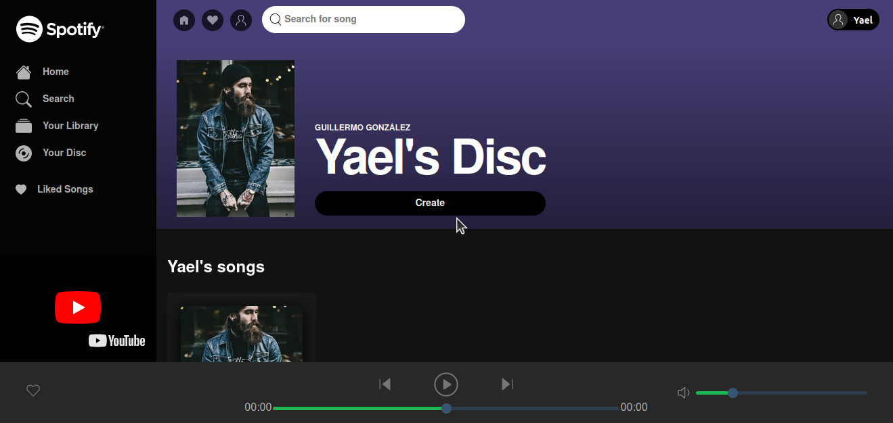

Clicking **“Create”** redirects to **“Create New Song for your Disc”**

This screen includes:

* Title
* Genre(s)
* Duration
* YouTube Video Link
* "Create Disc" Button

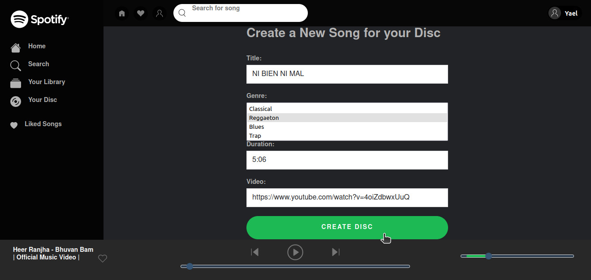

After creating an album:

* Album Info
* "Update" Button
* "Delete" Button

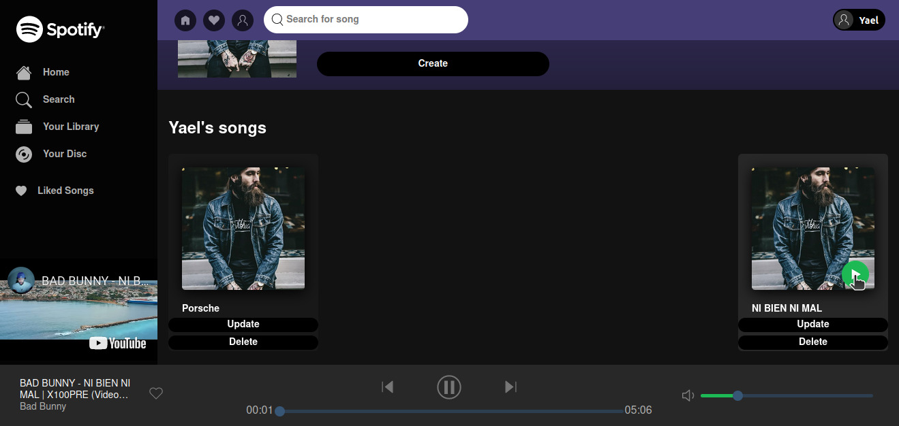

**Update User Disc Screen**

Allows editing an existing disc:

* Title
* Songs/Genres
* Description
* Video Link
* "Update Disc" Button

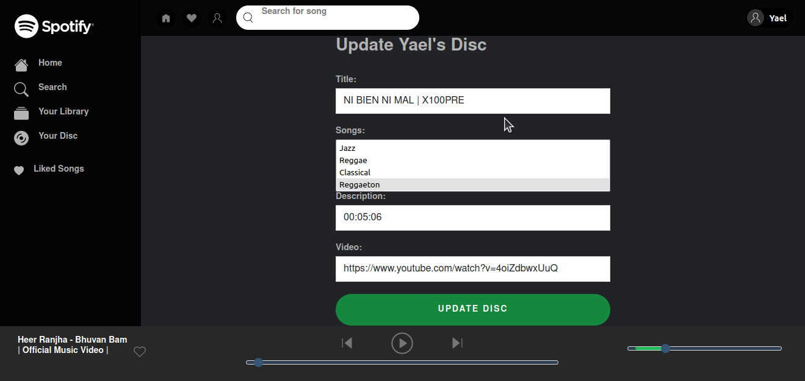

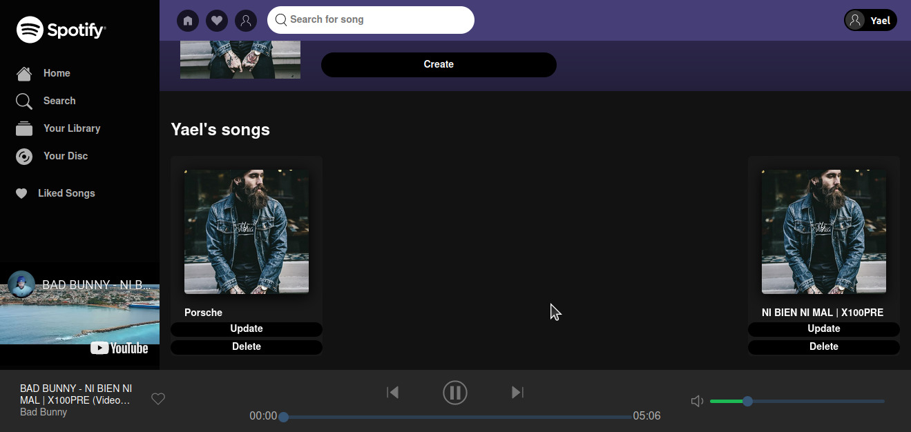

Selecting **"Delete"** permanently removes the album and its content.

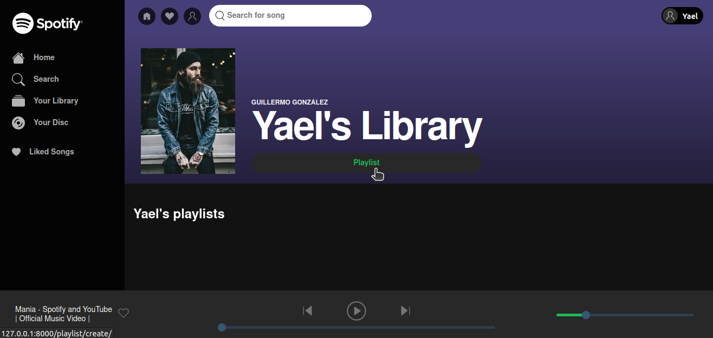

**Create Playlist Screen**

Allows creation of playlists:

* Title
* Songs
* Description

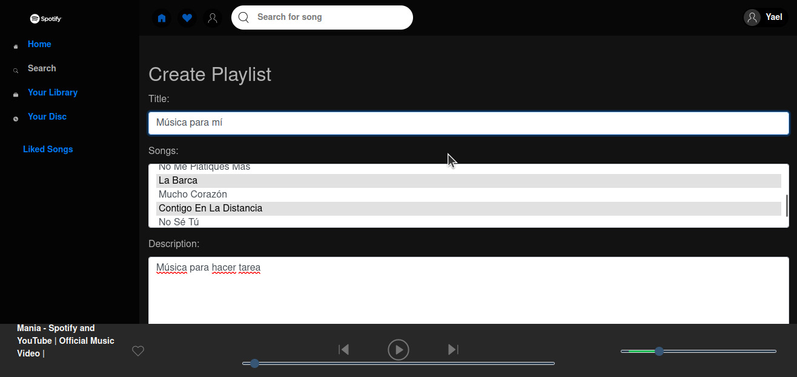

After creation, users can open, update, or delete the playlist.

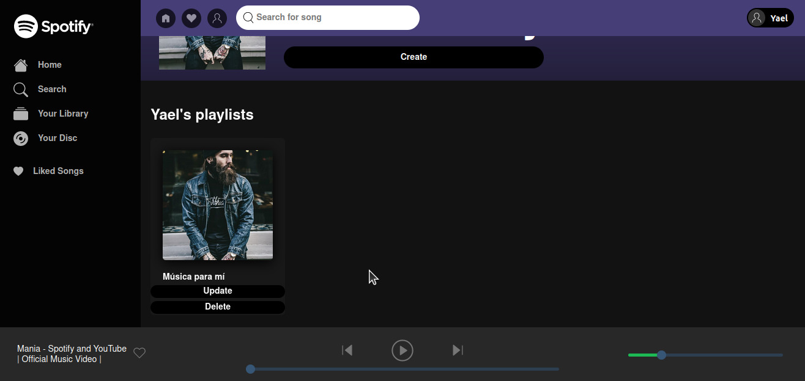

Playlist view includes:

* Creator Name
* Title
* Song List with:

  * Title
  * Album
  * Artist
  * Duration

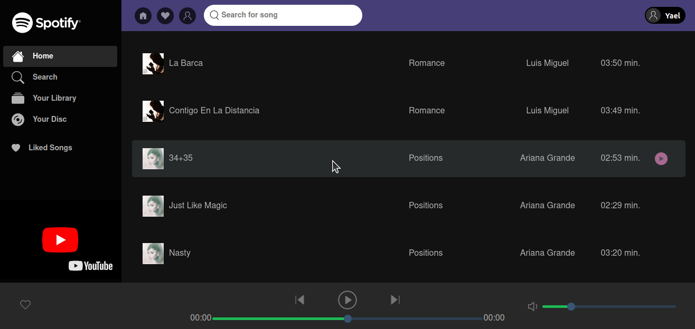

**Artist Profile Screen**

Includes:

* Artist Image
* Name
* Genre
* Country
* Biography
* Age
* Albums

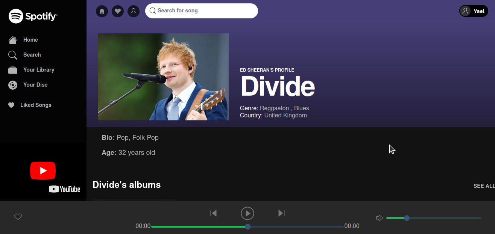

**Country Screen**

Groups artists by country:

* Artist List by Country
* Redirect to Artist Profile

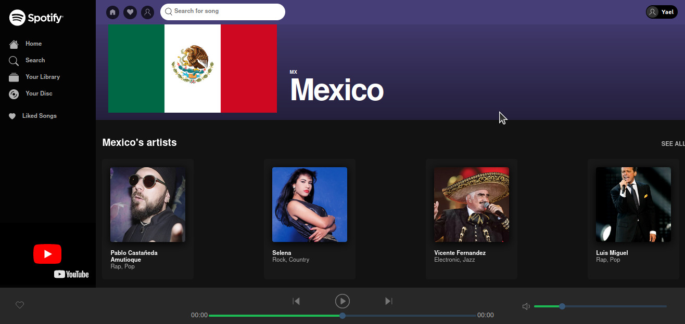

**Genre Screen**

Groups artists by genre:

* Artist List by Genre
* Redirect to Artist Profile

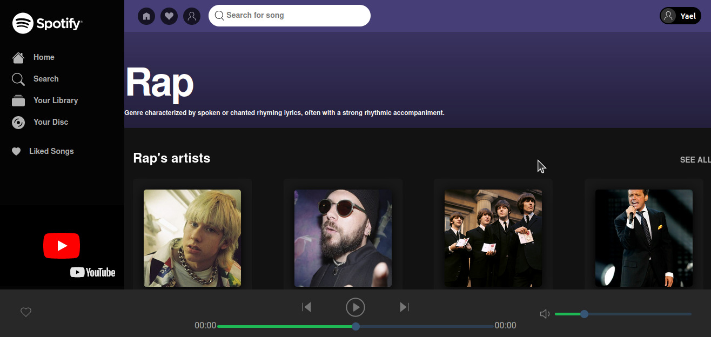
